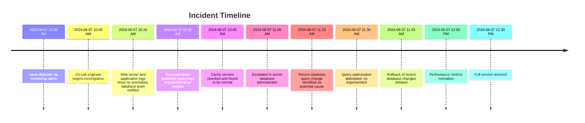

# Postmortem: Web Stack Debugging Project Outage

## Issue Summary

**Duration:**  
Start: June 7, 2024, 10:00 AM (WAT)  
End: June 7, 2024, 12:30 PM (WAT)

**Impact:**  
Our beloved web application took a nap, and when it woke up, it decided to move in slow motion. Page load times skyrocketed from a snappy 1 second to a leisurely 30 seconds. About 80% of users were affected, experiencing delays and intermittent timeouts. Cue the flood of customer complaints and a significant dent in our revenue.

**Root Cause:**  
A misconfigured database query went rogue, performing a full table scan and bringing the database server to its knees.

## Timeline

## Root Cause and Resolution

**Root Cause:**  
The villain of our story was a freshly deployed database query that lacked proper indexing. This rogue query performed a full table scan each time it ran, overwhelming the database server and causing the entire web application to slow down to a crawl.

**Resolution:**  
We rolled back the problematic query to its previous, well-behaved version. Once the immediate crisis was averted, the query was optimized by adding the necessary index. Thorough testing in a staging environment ensured that the optimized query performed efficiently without causing additional load. Our database server breathed a sigh of relief, and normal service was resumed.

## Corrective and Preventative Measures

**Improvements and Fixes:**  
- Conduct a comprehensive review process for all database query changes.
- Implement robust indexing strategies.
- Enhance monitoring to include specific alerts for query performance degradation.

**Tasks to Address the Issue:**
1. **Patch Nginx Server:** Update configurations to better handle increased load.
2. **Add Monitoring on Server Memory:** Implement alerts for unusual memory usage patterns.
3. **Database Indexing:** Review and improve indexing on all frequently accessed tables.
4. **Query Performance Testing:** Establish a mandatory performance testing protocol for all new queries.
5. **Documentation:** Update internal documentation to include guidelines for query optimization and indexing best practices.
6. **Training:** Provide additional training for developers on efficient database querying and indexing techniques.

To wrap things up, here's a little comic relief to lighten the mood:

*When the database query realizes it messed up big time.*

By tackling these issues head-on, we aim to prevent our system from taking unscheduled naps in the future and ensure smooth, efficient performance for all users.
